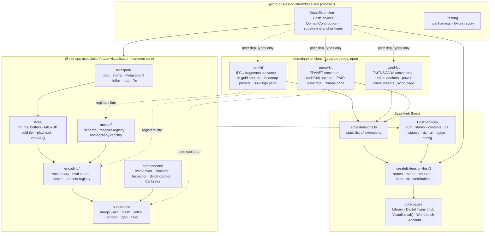

# DTaaS Client: Modular Domain Extensions

**Status:** Proposal (revision 2)
**Scope:** `client/` of `INTO-CPS-Association/DTaaS` (branch `feature/distributed-demo`, `@into-cps-association/dtaas-web` 1.7.0)
**Reference implementation of the pattern:** `@into-cps-association/bim-kit` 0.1.1 and `client/src/route/bim/`
**Companion document:** *A Visualisation Layer for Web-Based Digital Twin Platforms* (`DTaaS-Visualisation-Layer.pdf`, sources in `tex/`). Requirements R1–R11, techniques T1–T14 and the six-layer architecture referenced below are defined there.

---

## 1. Problem

DTaaS today ships one web client with a fixed set of pages. The Buildings page
already follows the right instinct: the domain logic (IFC parsing, three.js
rendering, sensor heatmaps) lives in a separately versioned npm package,
`bim-kit`, and the client holds only three wiring files. A change to how a
building is drawn is a dependency bump, not a pull request against DTaaS.

Two problems remain, and the second is the larger one.

### 1.1 The wiring is hard-coded

The wiring is still hard-coded in five places in the client, and each new
domain (wind turbines, water pumps, hospitals, …) would have to touch all five
again:

| Wiring point | File | What was edited for Buildings |
| --- | --- | --- |
| Route table | `src/routes.tsx` | `lazy(() => import('route/bim/Bim'))` + a route entry |
| Left navigation | `src/page/MenuItems.tsx` | a `menuItems` entry with icon and link |
| Icon registry | `src/components/appIcons.tsx` | `BuildingModelsIcon` |
| Page adapter | `src/route/bim/*` | `Bim.tsx`, `library.ts`, `persistGeometry.ts` |
| Dependency | `package.json` | `@into-cps-association/bim-kit` |

There is no contract that says what a domain package may contribute, how it
reaches the signed-in user's library, how it gets live sensor data, or how it
is switched off for a deployment that does not need it. `Bim.tsx` reaches into
`store/store`, `util/envUtil` and `util/auth/Authentication` directly, so
`bim-kit` is decoupled from DTaaS but the adapter is not.

### 1.2 Each domain kit re-implements the layers that are not domain-specific

`bim-kit` is vertically integrated. Reading its README and `Bim.tsx`, one
package currently owns all of the following:

| Concern | How `bim-kit` does it today | Is it building-specific? |
| --- | --- | --- |
| Live data transport | Subscribes to MQTT topics named in `.manifest.json` | **No.** Every domain reads the same RabbitMQ. |
| Binding a signal to geometry | `.manifest.json` maps sensor → IFC object → topic | **Partly.** The *key* (IFC `GlobalId`) is domain-specific; the *mechanism* (an authored, persisted signal→location map) is not. |
| Visual encoding | Heatmap; scopes per sensor / room / floor / building; flood-fill rasterisation | **Partly.** Flood-fill through walls is building-specific; colour scale, threshold and scoping are not. |
| Time | Latest reading only | **No** — and the absence is the problem: no replay, no history, no simulated-vs-measured. |
| Rendering | three.js scene, IFC → GLB via `web-ifc` | **No.** The `aec` substrate serves hospitals and plants as well as buildings. |
| Persistence of converted geometry | `persistGeometry.ts` → workspace Contents API | **No.** |

A `wind-kit` and a `pump-kit` built the same way would each re-implement the
transport, the binding mechanism, the encoding rules, the time handling and the
persistence — and each would make the same "latest value only" decision, which
the companion report identifies as the one decision that cannot be retrofitted
(R4, R5). The report's central finding applies here directly:

> The renderer is an implementation detail. The durable, reusable artefacts are
> transport normalisation, the temporal state store, anchor resolution and the
> encoding vocabulary. None exist off the shelf, which is why they are worth
> building — **once**.

It also applies a second distinction that the current package boundary
conflates: **domain** (buildings, wind, pumps, hospitals) is not the same axis
as **substrate** (an IFC model, a glTF assembly, a photograph, a video feed, a
georeferenced tile set). Hospitals and buildings are one substrate; a pump
station has a P&ID schematic, a photograph of the plant floor *and* a 3D
model; and every domain has photographs before it has models. A kit that owns
its own renderer cannot share it with the next kit that needs the same one.

The goal is therefore a client that is a **host** plus a **common
visualisation core** plus zero or more **domain extensions**, where:

- the host provides platform services (auth, library, contents, GitLab, UI);
- the common core provides the domain-independent layers — transport, temporal
  state, anchor resolution, encoding rules, substrate adapters — once, against
  the services `dtaas-services` already deploys (R10);
- a domain extension is an npm package that contributes only what is genuinely
  unique to its domain: asset converters, anchor namespaces, encoding presets,
  domain pages and navigation.

## 2. Goals and non-goals

**Goals**

1. A domain extension is an ordinary npm package. Adding or removing one is a
   change to two files in the client: `package.json` and an extension manifest.
2. The extension contract is a versioned, published package with no runtime
   code of its own that the host must ship. Type-checking catches a
   contract mismatch at build time.
3. Extensions never import DTaaS internals. Everything they need from the host
   (library URL, user, contents API, snackbar, logger, signals, substrates)
   arrives through an injected `HostServices` object.
4. Heavy code (WASM kernels, renderers) stays out of the entry chunk. The host
   enforces this; it is not left to the package.
5. A deployment can disable an extension that was compiled in, without a
   rebuild, through the existing `env.js` mechanism.
6. Core CI proves the host still builds and passes tests with **no** extensions.
7. Licence obligations of each extension's dependency tree are checked in CI,
   because compile-time bundling makes every extension dependency part of the
   distributed `dtaas-web` artefact.
8. **Common layers are built once.** Transport, temporal store, anchor
   resolution, encoding rules and the standard substrate adapters live in one
   package that every extension consumes and none re-implements (R1, R3, R4,
   R5, R6).
9. **Substrates are shared across domains.** The `aec`, `mesh`, `image`,
   `video`, `geo`, `field` and `embed` adapters are not owned by any domain
   kit. A kit may *add* a substrate adapter (a P&ID schematic renderer, say),
   but never bundle a private copy of a standard one.
10. **The installed stack is consumed, not duplicated.** Live data comes from
    the deployed RabbitMQ (MQTT and AMQP), history from InfluxDB, the device
    registry from ThingsBoard, charts from an embedded Grafana, and versioned
    persistence from GitLab through `@gitbeaker/rest` (R10). This settles the
    transport question left open in issue 1762.
11. **A visualisation is a library asset.** A `visualisation.json` is a DT asset
    like a model or a function: authored in the client, committed to GitLab,
    reviewed as a merge request, reused by another user (R7).

**Non-goals (for this iteration)**

- Runtime plugin loading (Module Federation, `import()` from a URL). The
  contract below is designed so that this can be added later without changing
  extensions; see §10.
- Server-side extension points (lib microservice, runner). This document is
  client only, except for the MIME-type and range-request changes to
  `servers/lib` that substrates need.
- The `geo` and `field` substrates and the T3/T4/T5/T7 techniques. They are
  designed for (the adapter interface admits them) but scheduled after the
  first three domains ship.

## 3. Options considered

Ranked. The first is recommended. The options concern how extensions are
*discovered*; the common/domain split in §5 is orthogonal and applies to all
of them.

### Option A — Static extension manifest, compile-time registry *(recommended)*

The client has one file, `src/extensions.ts`, that imports each extension's
`dtaas` entry point and passes the array to a `createExtensionHost()` that
builds routes, menu, reducers and contributions. Vite tree-shakes and
code-splits as usual.

- **For:** simplest thing that meets every goal; fully type-checked; the
  manifest is readable by a reviewer and greppable; works with the existing
  Jest, Playwright and `madge` tooling; no build plugin to maintain.
- **Against:** a downstream deployer who wants a different extension set has to
  fork or patch one file and rebuild. That is acceptable because the same
  deployer already has to edit `package.json`.

### Option B — Auto-discovery from `package.json` via a Vite virtual module

- **For:** one file to edit instead of two.
- **Against:** a virtual module is invisible to Jest without a moduleNameMapper
  shim, to `madge`, and to a reviewer reading the diff; a typo in
  `package.json` fails late. Can be layered onto A later if wanted.

### Option C — Runtime plugins (Vite/Webpack Module Federation)

- **For:** deployers add extensions without rebuilding `dtaas-web`.
- **Against:** React, MUI, Redux and three.js must be shared singletons across
  bundles, which is fragile across major versions; CSP has to allow the remote
  origins; the WASM-from-same-origin guarantee that `bim-kit` currently gives
  is lost; type-checking across the boundary is gone; no user has asked for it.
  The contract in §6 is kept free of build-tool assumptions so this remains an
  upgrade path.

### Option D — iframe micro-frontends per domain

- **Against:** no shared Redux state, no shared theme, no shared auth session
  without a postMessage protocol, and — decisive now — no shared *playhead*.
  Substrates that cannot sample one clock cannot deliver replay (T6), the ghost
  twin (T9) or video synchronisation (T14). The `embed` substrate uses iframes
  deliberately for Grafana, ThingsBoard and the workspace desktop, and drives
  them through URL time parameters; that is the correct and limited use of an
  iframe here. Rejected as the general mechanism.

## 4. Target architecture



Four package roles:

| Role | Package | Owner / repo | Ships runtime code? |
| --- | --- | --- | --- |
| Contract | `@into-cps-association/dtaas-sdk` | DTaaS monorepo, `client/sdk/` (published) | Types, a few tiny helpers, a test harness. No React components. |
| Common core | `@into-cps-association/dtaas-visualisation` | DTaaS monorepo, `client/viz/` (published) | Yes: transport, store, anchors, encodings, standard substrates, viewer components. Reusable by other web-based DT platforms — that is the stated goal of the companion report. |
| Host | `@into-cps-association/dtaas-web` | DTaaS monorepo, `client/` | Yes |
| Extension | `@into-cps-association/<domain>-kit` | One repo per domain (e.g. `ifc-utils` for `bim-kit`) | Yes, lazily loaded by the host |

The SDK and the common core live in the monorepo because their versions must
move in lock-step with the host; extensions live outside because their release
cadence is the whole point. The common core is published separately from the
host so that it can be used by a platform that is not DTaaS; the host is its
first consumer, not its only one.

## 5. What is common and what is domain-specific

This is the section the rest of the document depends on. The split follows the
companion report's six layers, with the additional observation that
**substrate** and **domain** are different axes.

### 5.1 Layer by layer

| Layer | Common (`dtaas-visualisation`) | Domain kit contributes | Host contributes |
| --- | --- | --- | --- |
| **1 Transport** | `SignalSample` shape; adapters for MQTT/WSS and AMQP/Web-STOMP against the deployed RabbitMQ, ThingsBoard WebSocket telemetry, InfluxDB `range()`, HTTP/SQL, file replay (CSV/Parquet) | Nothing. A kit names *which* topics or buckets in its presets; it never opens a socket. | Endpoint discovery from `env.js` (broker URL, Influx org, ThingsBoard host) |
| **2 Temporal store** | Hot ring buffers per `(signalPath, channel)`; InfluxDB cold tier; one playhead; `valueAt(path, channel, t)`; measured / simulated / predicted / setpoint channels | Nothing. | Playhead and connection status in Redux (`state.viz`); buffers outside Redux |
| **3 Anchor resolution** | `Anchor` schema; resolver registry; homography registry for image substrates; `tb-entity` resolver against ThingsBoard | **Domain anchor kinds and resolvers**: `ifc-guid` (bim), `turbine:<id>/<component>` (wind), `epanet:<node|link>` (pump). Migration from `.manifest.json`. | Nothing |
| **4 Encoding** | Vocabulary (`colorScale`, `visibility`, `transform`, `flow`, `residual`, `ghost`, `label`, `attention`, `glyph`, `regionFill`, `fieldOverlay`, `trajectory`); evaluators; colour scales | **Presets**: named, domain-typed encoding bundles — "thermal comfort per room", "power curve deviation", "network pressure". Also **domain scoping rules** (bim: per room / floor via the IFC spatial tree; pump: per pressure zone). | Nothing |
| **5 Substrates** | `image`, `aec`, `mesh`, `video`, `embed`; later `geo`, `field`. Each behind `SubstrateAdapter`. | **Only substrates no standard adapter covers**, e.g. a P&ID SVG schematic for pumps, a wake-plan canvas for wind. Registered through the same interface. | Nothing |
| **Asset pipeline** | Generic loaders (glTF, IFC via `@thatopen`, image, HLS) | **Converters** for domain formats: IFC → fragments (moves from `bim-kit`'s `web-ifc` path into a converter the `aec` substrate calls), FAST `.fst`/`.out` → time series + glTF, EPANET `.inp` → graph + geometry. | Where converted output is stored (`common/models`, via `contents`) |
| **Viewer UI** | `TwinViewer`, `Timeline`, `Inspector`, `BindingEditor`, `Calibrator`, `Legend`; the generic **Visualise** DT tab | **Domain pages** (`/bim`, `/wind`, `/pump`), navigation, asset previews, domain-specific inspector panels | Layout, PageShell, theme |
| **Persistence** | `visualisation.json` schema + zod; load/save through `HostServices.git` and `HostServices.library` | Domain asset-detection rules (which files make a DT "a building twin") | `@gitbeaker/rest` client, library URL, Contents API |
| **Dashboards** | `embed` substrate driving Grafana / ThingsBoard panels from the playhead (T10) | Panel URL templates in presets | Grafana / ThingsBoard base URLs |

Read column-wise: the domain kit column is short. That is the point. A kit for
a new domain writes converters, anchor resolvers, presets and a page. It writes
no socket code, no time handling, no renderer and no colour-scale
implementation.

### 5.2 Substrate versus domain

| Substrate | Backing library (common) | Domains that use it |
| --- | --- | --- |
| `image` | `react-konva`, `opencv-ts` (homography), `leaflet` for very large images | **All.** Photographs, plans and scanned drawings exist before models do; this is the first substrate to build and the fallback for every twin (R9). |
| `aec` | `@thatopen/components` + `@thatopen/fragments` | Buildings, hospitals, plants — any IFC. `bim-kit`'s renderer migrates here. |
| `mesh` | `react-three-fiber` + `drei` (+ `urdf-loader`) | Machines, wind turbines, pumps, robots — any glTF assembly. |
| `video` | `HTMLVideoElement` + `hls.js` / WebRTC | Any domain with a camera; skew must be declared (R11). |
| `embed` | `react-iframe` (already a client dependency) | Any: Grafana, ThingsBoard, the workspace VNC desktop. |
| `geo` | `CesiumJS` / `3DTilesRendererJS` | City, mobility, marine. Later. |
| `field` | `vtk.js` | Simulation fields for any domain. Later. |

A `wind-kit` does not bring a renderer; it declares that a turbine twin uses
`mesh` for the nacelle assembly, `image` for the site photograph, `embed` for
the SCADA Grafana board, and supplies the converters and presets that make
those substrates meaningful for a turbine.

### 5.3 What migrates out of `bim-kit`

| In `bim-kit` 0.1.1 | Destination | Why |
| --- | --- | --- |
| MQTT subscription | `dtaas-visualisation/transport/mqtt` | Common (R3, R10) |
| `.manifest.json` sensor → object → topic | `anchors` + `transports` sections of `visualisation.json`; `bim-kit` ships a one-time migration | Authored anchoring is common; the IFC key is the domain part (R2) |
| three.js scene, `web-ifc` load | `substrates/aec` (`@thatopen`), with `bim-kit` providing the IFC → fragments converter | Substrate, not domain (goal 9) |
| Heatmap colour scale and thresholds | `encoding/colorScale` + a `bim-kit` preset | Common vocabulary, domain preset |
| Per-room / per-floor scoping and wall-aware flood fill | `bim-kit` scoping rule + `fieldOverlay` encoding with a `bim`-supplied interpolation kernel | Genuinely building-specific: it walks the IFC spatial tree and respects walls. Stays in the kit, plugged into the common encoding. |
| `persistGeometry.ts` | `HostServices.contents` (host) | Common |
| The Buildings page | `bim-kit/src/dtaas/pages` | Domain |

After migration `bim-kit` is smaller, and `wind-kit` starts from the same
size rather than from zero.

## 6. The extension contract (`dtaas-sdk`)

### 6.1 Shape of an extension

```ts
// @into-cps-association/dtaas-sdk
import type { ComponentType, LazyExoticComponent, ReactElement } from 'react';
import type { Reducer } from '@reduxjs/toolkit';

export interface DtaasExtension<S = unknown> {
  /** Stable, lowercase, used as a route prefix, Redux key and env.js key. */
  id: string;                      // 'bim', 'wind', 'pump'
  name: string;
  version: string;
  /** Highest dtaas-sdk major this extension was built against. */
  sdk: 1;

  /** Pages. Each becomes `/<id>` or `/<id>/<path>`. `element` MUST be lazy. */
  routes?: ExtensionRoute[];
  navigation?: NavigationItem[];
  /** Tabs added to the Digital Twins page beyond the generic Visualise tab. */
  digitalTwinTabs?: DigitalTwinTab[];
  /** Previewers for files in the Library, keyed by extension or MIME type. */
  assetPreviews?: AssetPreview[];
  /** Redux slice mounted at `state.ext.<id>`. */
  reducer?: Reducer<S>;
  /** Runtime configuration this extension reads from `env.js`, with zod schema. */
  config?: ExtensionConfigSpec;
  /** Called once after the store exists and HostServices are ready. */
  setup?: (host: HostServices) => void | Promise<void>;

  /** What this domain contributes to the common visualisation core. */
  visualisation?: DomainContribution;
}

/** The domain-specific parts of the six layers. Everything else is common. */
export interface DomainContribution {
  /** Which DTs this domain claims, e.g. an `.ifc` in the DT folder or `domain: bim` in its description. */
  detect: (dt: DigitalTwinSummary) => boolean | Promise<boolean>;
  /** Domain anchor kinds and how to resolve them on a substrate. */
  anchorKinds?: AnchorKindSpec[];          // { kind: 'ifc-guid', substrates: ['aec'], resolve }
  /** Asset converters the substrates call. Lazy; may pull in WASM. */
  converters?: ConverterSpec[];            // { from: /\.ifc$/i, to: 'fragments', run: lazy(...) }
  /** Named encoding bundles a user can pick in the binding editor. */
  presets?: EncodingPreset[];              // { id: 'bim.thermal-comfort', substrate: 'aec', encodings: [...] }
  /** Domain grouping rules used by presets, e.g. per room / floor via the IFC spatial tree. */
  scopes?: ScopeRule[];
  /** Interpolation kernels for fieldOverlay, e.g. wall-aware flood fill. */
  fieldKernels?: FieldKernelSpec[];
  /** Substrates no standard adapter covers, e.g. a P&ID schematic. Lazy. */
  substrates?: LazySubstrateAdapterSpec[];
  /** Optional domain panel inside the common Inspector. */
  inspectorPanel?: LazyExoticComponent<ComponentType<{ selection: ElementRef }>>;
}
```

Every `element`, converter and substrate is lazy. The registry checks this
with a type guard and a unit test, which is how goal 4 is enforced rather than
hoped for.

### 6.2 What the host provides (`HostServices`)

This replaces the direct imports that `Bim.tsx` makes today and, more
importantly, replaces the single `live.subscribe(topic)` of the first draft
with the common core's transport-and-store contract. Issue 1762's
"RabbitMQ or platform service?" question is answered in one place: both,
through adapters the core owns.

```ts
export interface HostServices {
  auth: {
    user(): Promise<{ username: string }>;
    useUser(): { username: string } | null;
  };
  library: {
    baseUrl(): Promise<string>;
    useBaseUrl(): string | null;
    conventions: { modelsDirectory: string; digitalTwinsDirectory: string; visualisationsDirectory: string };
    /** Resolve lib:// and ws:// (workspace) URLs to fetchable URLs. */
    resolve(url: string): Promise<string>;
  };
  contents: {
    /** Workspace Jupyter Contents API, credentialed, XSRF-aware. Extracted from persistGeometry.ts. */
    list(path: string): Promise<ContentsEntry[]>;
    get(path: string): Promise<Uint8Array>;
    put(path: string, bytes: Uint8Array, opts?: PutOptions): Promise<void>;
    exists(path: string): Promise<boolean>;
  };
  git: {
    /** Thin wrapper over @gitbeaker/rest under the signed-in OAuth2 session. */
    read(repo: string, path: string, ref?: string): Promise<Uint8Array>;
    commit(repo: string, branch: string, changes: FileChange[], message: string): Promise<{ sha: string }>;
    openMergeRequest?(repo: string, source: string, target: string, title: string): Promise<{ url: string }>;
  };

  /** The common core, layers 1–4. Extensions consume, never re-implement. */
  signals: {
    /** Live subscription through the deployed RabbitMQ / ThingsBoard adapters. */
    subscribe(paths: string[], channel: Channel, sink: (s: SignalSample) => void): () => void;
    /** Read at the playhead. Hot ring buffer first, InfluxDB backfill when outside the live window. */
    valueAt(path: string, channel: Channel, t?: number): Sampled | undefined;
    range(paths: string[], channel: Channel, from: number, to: number): Promise<SignalSample[]>;
    /** One clock for every substrate, embedded panel and video element. */
    playhead: { get(): number; set(t: number): void; follow(live: boolean): void; use(): number };
    /** ThingsBoard device / asset registry, for authoring tb-entity anchors. */
    registry: { search(q: string): Promise<TbEntity[]>; get(id: string): Promise<TbEntity> };
  };
  viz: {
    /** Load / validate / save a visualisation.json for a DT (library or GitLab, per deployment config). */
    load(dt: DigitalTwinSummary): Promise<VisualisationAsset | null>;
    save(dt: DigitalTwinSummary, asset: VisualisationAsset, opts?: { viaMergeRequest?: boolean }): Promise<void>;
    /** Registry of substrate adapters: the standard set plus any a kit contributed. */
    substrates: { get(id: string): Promise<SubstrateAdapter>; list(): string[] };
    /** Registry of anchor kinds, presets, scopes and kernels, merged from all kits. */
    anchorKinds: AnchorKindSpec[]; presets: EncodingPreset[];
  };

  ui: {
    snackbar(message: string, severity: 'success' | 'info' | 'warning' | 'error'): void;
    Page: ComponentType<{ title: string; description?: string; children: React.ReactNode }>;
  };
  logger: { debug(...a: unknown[]): void; info(...a: unknown[]): void; warn(...a: unknown[]): void; error(...a: unknown[]): void };
  settings: { get<T>(key: string): T | undefined };
  config: <T>(schema: ZodType<T>) => T;
}
```

Delivered by a React context (`useHost()`) for components and passed as the
argument of `setup()` for non-React code. The host owns the implementation of
`auth`, `library`, `contents`, `git`, `ui`, `logger`, `settings`, `config`;
the common core owns the implementation of `signals` and `viz` and the host
merely instantiates it with endpoints from `env.js`. Extensions only see the
interface, so the `HostServices` shape is the whole coupling surface and is
what the SDK major version tracks.

### 6.3 Where an extension is allowed to reach

| Extension may | Extension may not |
| --- | --- |
| Import from `@into-cps-association/dtaas-sdk` (types, `useHost`) | Import anything from `@into-cps-association/dtaas-web` |
| Import from `@into-cps-association/dtaas-visualisation` **only** its public `contribute/*` helpers (preset builders, anchor-kind helpers, `defineSubstrate`) | Import `dtaas-visualisation/transport`, `/store` or `/substrates/*` internals; open its own MQTT/STOMP/WebSocket; hold its own sample history |
| Import React, MUI, zod as **peer** dependencies | Bundle its own copy of React/MUI |
| Import three.js / konva / cesium **only** inside a contributed `SubstrateAdapter` or converter, as a peer dependency | Render a standard substrate with its own copy of a rendering library |
| Read its own slice `state.ext.<id>` | Read core slices (`auth`, `settings`, `viz`) directly; go through `HostServices` |
| Write to `common/<something>` through `contents.put`, or commit through `git.commit` | Write anywhere else; the host's path guard refuses it |
| Ship a zod schema for its `env.js` config | Read `globalThis.env` |

Enforced by ESLint `no-restricted-imports` in the SDK's shareable config, which
extensions extend. The rule against opening sockets is what keeps "latest
value only" from being reinvented in a kit.

## 7. Package layouts

### 7.1 The common core (`client/viz/`, published as `dtaas-visualisation`)

Taken from the companion report, §6, with the registries that kits contribute
into made explicit:

```
client/viz/
  src/
    transport/       # L1: mqtt, stomp, thingsboard, influx, http, file
    store/           # L2: hot ring buffers + InfluxDB cold tier, playhead, valueAt()
    anchor/          # L3: schema, resolver registry, homography registry
    encoding/        # L4: vocabulary, evaluators, scales, preset registry
    substrates/
      image/         # react-konva + opencv-ts (+ leaflet)
      aec/           # @thatopen/components + fragments
      mesh/          # react-three-fiber + drei (+ urdf-loader)
      video/         # HTMLVideoElement + hls.js / WebRTC
      embed/         # react-iframe: Grafana, ThingsBoard, workspace VNC
      geo/           # CesiumJS / 3DTilesRendererJS         (later)
      field/         # vtk.js                                (later)
    components/      # TwinViewer, Timeline, Inspector, BindingEditor, Calibrator, Legend
    contribute/      # PUBLIC: definePreset, defineAnchorKind, defineSubstrate, defineConverter
    schema/          # visualisation.json JSON Schema + zod
  test/
    fixtures/        # recorded streams + reference images for offline replay
```

Only `contribute/`, `components/` and `schema/` are public exports. Substrates
load lazily; an image-only twin never downloads `@thatopen` or three.js.

### 7.2 A domain kit (generalising `bim-kit`)

`bim-kit` already has the right internal separation: `./viewer` and
`./converter` know nothing about React, `./react` knows nothing about DTaaS.
The viewer moves out (§5.3); the converter stays; one layer is added.

```
<domain>-kit/
  src/
    core/         framework-free domain logic: converters, anchor resolvers, scope rules, field kernels
    react/        domain components usable in any React app (inspector panels, domain pages' widgets)
    dtaas/        the DtaasExtension object
      index.ts    export const extension: DtaasExtension = { id: 'wind', visualisation: {...}, … }
      pages/      lazy page components that call useHost()
      presets/    EncodingPreset[] built with dtaas-visualisation/contribute
      anchors.ts  AnchorKindSpec[]
      converters.ts
      slice.ts    optional Redux slice
      config.ts   zod schema for env.js keys
  package.json
    "exports": { ".": …, "./react": …, "./dtaas": "./dist/esm/dtaas/index.js", … }
    "peerDependencies": {
      "@into-cps-association/dtaas-sdk": "^1",
      "@into-cps-association/dtaas-visualisation": "^1",   // contribute/* only
      "react": ">=18", "@mui/material": ">=5", …
    }
  LICENSE.md, THIRD-PARTY.md
```

The `./dtaas` subpath is the only one the host imports. `./core` and `./react`
keep working outside DTaaS.

### 7.3 Concrete mapping for the three named domains

| | `bim-kit` (exists) | `wind-kit` | `pump-kit` |
| --- | --- | --- | --- |
| **Common, consumed as-is** | transport · store · playhead · encoding vocabulary · `aec` `image` `embed` substrates · viewer UI · `visualisation.json` persistence | same | same |
| Asset format(s) → converter | IFC → fragments; `.manifest.json` → `visualisation.json` migration | SCADA CSV → time series; FAST `.fst`+`.out` → time series; turbine GLB (none) | EPANET `.inp` → graph + geometry; P&ID SVG; pump curve JSON |
| Anchor kind(s) | `ifc-guid` on `aec` | `turbine:<id>/<component>` on `mesh` (`blade1`, `nacelle`, `gearbox`) | `epanet:<node|link>` on `mesh` and on the kit's `pid` substrate |
| Substrates used | `aec`, `image` (floor photo / plan), `embed` (Grafana) | `mesh`, `image` (site photo), `video` (nacelle camera), `embed` (SCADA board) | `mesh`, **`pid` (kit-contributed)**, `image` (plant photo), `embed` |
| Presets | thermal comfort per room; CO₂ per floor; occupancy | power-curve deviation (measured vs simulated — T9); wake plan; vibration | network pressure map; residual vs EPANET (T9); flow direction (T5) |
| Domain scoping / kernels | per room / floor via IFC spatial tree; wall-aware flood fill | per turbine / per string | per pressure zone |
| Route / navigation | `/bim` Buildings | `/wind` Wind Farms | `/pump` Water Networks |
| Extra DT tab | none (generic Visualise suffices) | none | Schematic (the `pid` substrate full-screen) |
| Asset preview | `.ifc`, `.glb` | `.fst`, `.out` | `.inp` |
| Live data | MQTT topics per sensor | SCADA averages via ThingsBoard | pressure/flow per node via MQTT |

Two things the table makes visible. First, *hospitals need no kit*: a hospital
twin is an `aec` substrate with different presets, and presets can live in the
DT's own `visualisation.json`. A `hospital-kit` becomes worthwhile only when it
has something to convert or a domain scoping rule to add (ward, theatre, bed).
Second, the one genuinely new renderer in three domains is the P&ID schematic,
and it plugs in through the same interface the standard substrates use.

## 8. Host changes (`client/`)

### 8.1 New files

```
client/
  sdk/                              # published as @into-cps-association/dtaas-sdk
    src/index.ts                    # types from §6
    src/testing.tsx                 # renderWithHost(), fakeHostServices(), replayFixture()
    package.json
  viz/                              # published as @into-cps-association/dtaas-visualisation (§7.1)
  src/
    extensions.ts                   # THE manifest
    extension/
      createExtensionHost.ts        # registry: validates and merges contributions, incl. visualisation
      HostProvider.tsx              # implements HostServices; instantiates the viz core with env.js endpoints
      contentsClient.ts             # moved from route/bim/persistGeometry.ts, generalised
      gitClient.ts                  # wraps the existing @gitbeaker/rest usage
      ext.slice.ts                  # combineSlices for state.ext.*
    route/digitaltwins/visualise/   # the generic Visualise tab: <TwinViewer/> + Timeline + Inspector
```

`src/extensions.ts` in full:

```ts
import type { DtaasExtension } from '@into-cps-association/dtaas-sdk';
import { extension as bim } from '@into-cps-association/bim-kit/dtaas';
import { extension as wind } from '@into-cps-association/wind-kit/dtaas';

/**
 * Every domain extension compiled into this build, in menu order.
 * Adding one: `yarn add` it, import it here. Removing one: the reverse.
 * A deployment can still hide a compiled-in extension with env.js
 * `REACT_APP_EXTENSIONS_DISABLED: 'wind'`.
 *
 * The common visualisation core is not listed here: it is part of the host
 * and is present in every build, including one with no extensions.
 */
export const extensions: readonly DtaasExtension[] = [bim, wind];
```

### 8.2 Modified files

| File | Change |
| --- | --- |
| `src/routes.tsx` | Core routes stay literal. Append `...host.routes`. The hand-written `bim` entry goes. |
| `src/page/MenuItems.tsx` | `menuItems = [...coreItems, ...host.navigation]` sorted by `order`. |
| `src/components/appIcons.tsx` | `BuildingModelsIcon` removed; the extension owns its icon. |
| `src/store/storeTypes.ts` | Add `viz: vizSlice` (playhead, connections, subscriptions, selection, layout — **not** samples) and `ext: combineSlices(...)`. |
| `src/store/store.ts` | After store creation, instantiate the viz core with endpoints from `env.js`, then `await Promise.all(extensions.map(e => e.setup?.(hostServices)))`. |
| `src/route/digitaltwins/DigitalTwins.tsx` | Add the generic **Visualise** tab, shown when the DT has a `visualisation.json` *or* any extension's `detect(dt)` is true. Extension `digitalTwinTabs` are appended after it. |
| `src/route/library/*` | Register `visualisation` as an asset type in the listing and the composition cart; file click consults `host.assetPreviews`. |
| `src/route/measurement/*` | "Show on substrate" affordance on a row; the table samples `signals.playhead` so table and scene share one clock (T10). |
| `src/route/workbench/Workbench.tsx` | Where a twin's layout declares an `embed` pane for the VNC desktop, present it beside the web viewer. |
| `src/route/account/Account.tsx` | "Extensions" section listing id, name, version, enabled, and which anchor kinds / presets / substrates each registered. |
| `src/route/bim/` | **Deleted.** Wiring moves into `bim-kit/src/dtaas/`; the renderer moves into `viz/substrates/aec`. |
| `config/*.js` | New keys: `REACT_APP_EXTENSIONS_DISABLED`; `REACT_APP_VIZ_MQTT_URL`, `REACT_APP_VIZ_STOMP_URL`, `REACT_APP_VIZ_INFLUX_URL/ORG`, `REACT_APP_VIZ_THINGSBOARD_URL`, `REACT_APP_VIZ_GRAFANA_URL`, `REACT_APP_VIZ_PERSIST: 'library' \| 'gitlab'`; `REACT_APP_EXT_<ID>_*` per extension. |
| `vite.config.ts` | `manualChunks`: one chunk per extension `id` **and one per substrate** (`viz-aec`, `viz-mesh`, `viz-image`, …), so a twin downloads only the substrates it declares. |
| `servers/lib` | MIME types for `.glb`, `.ifc`, `.frag`; HTTP range requests for large images and models. The one server-side change this document asks for. |

### 8.3 Registry behaviour

`createExtensionHost(extensions, env)`:

1. Rejects duplicate `id`s and ids that collide with core routes.
2. Drops extensions listed in `REACT_APP_EXTENSIONS_DISABLED`, logging once.
3. Validates each extension's `config` schema against `env`; a failure disables
   that extension and raises a snackbar on first navigation.
4. Asserts every `element`, converter and substrate is lazy.
5. **Merges `visualisation` contributions** into the core registries: rejects
   duplicate anchor kinds and preset ids across kits; rejects a kit that
   registers a substrate whose `id` is one of the standard set (goal 9).
6. Returns `{ routes, navigation, digitalTwinTabs, assetPreviews, reducers, about, viz: { anchorKinds, presets, substrates, converters, detectors } }`.

Pure function, fully unit-testable without React.

## 9. Testing strategy

| Level | Where | What |
| --- | --- | --- |
| Registry unit | `client/test/unit/extension/` | duplicates, disabling, config validation, lazy assertion, contribution merging |
| **Core fixture replay** | `client/viz/test/` | Given a recorded stream and a `visualisation.json`, the core emits the expected sequence of resolved encodings over a scrubbed range **with no substrate mounted**. This is the report's Phase-0 exit criterion and the proof of R1. |
| Core substrate readback | `client/viz/test/` | For each standard substrate, mount, apply an encoding, read back the rendered property (encoding fidelity); frame-time vs. changed-element count (R6). |
| Host with zero extensions | CI job `client-no-ext` | `extensions.ts = []`; build + unit + e2e pass; the Visualise tab still works for a DT with a `visualisation.json` and an image substrate |
| Host with all extensions | existing CI | current suite |
| Extension conformance | `dtaas-sdk/testing` | `renderWithHost(extension, fakeHostServices())` mounts every route and tab; asserts no import of `dtaas-web` or of `dtaas-visualisation` internals; asserts no socket is opened; runs `replayFixture()` against the kit's presets |
| Extension e2e | kit repo | Playwright against a local DTaaS compose with the kit's build mounted over `intocps/dtaas-web`, as `route/bim/README.md` documents today |

The conformance harness is what makes "developed separately" safe: a kit can
prove it satisfies the contract without cloning DTaaS. The fixture-replay test
is what makes "built once" safe: the common core is verified before any
renderer exists.

## 10. Runtime loading as a later step

Nothing in §6 names Vite. If runtime loading is wanted later, the only change
is that `extensions.ts` becomes a fetch of a manifest URL plus
`import(/* @vite-ignore */ url)`, and the registry gains a runtime check of
`sdk` major. Extensions do not change. The common core is part of the host and
is never runtime-loaded.

## 11. Licence implications

Compile-time inclusion means every extension, the common core, and every
transitive dependency becomes part of the distributed `dtaas-web` JavaScript
and the `intocps/dtaas-web` Docker image.

1. **Copyleft anywhere contaminates the whole client bundle.** Add a CI gate in
   the host, the core and the SDK's shared config:
   `license-checker --onlyAllow 'MIT;ISC;BSD-2-Clause;BSD-3-Clause;Apache-2.0;MPL-2.0;0BSD;CC0-1.0;Unlicense;The INTO-CPS Association License'`.
   MPL-2.0 is allowed because it is file-level (`web-ifc`). LGPL in a browser
   bundle is contentious; exclude by default. The companion report's licence
   register (Appendix B) already applies this to the core's candidates:
   `xeokit-sdk` and `realvirtual WEB` are **excluded** (AGPL-3.0); `Potree` and
   `loaders.gl` report `NOASSERTION` and need a check before use; `konva` and
   `hls.js` report `NOASSERTION` on GitHub while declaring MIT and Apache-2.0 on
   npm, and must be recorded as explicit exceptions so the gate does not fail on
   repository metadata. Everything the core adopts is MIT, Apache-2.0 or BSD.
2. **The INTO-CPS licence on npm.** `bim-kit` publishes with
   `"license": "SEE LICENSE IN LICENSE.md"`. Recommend publishing the SDK, the
   common core, and the `core/` and `react/` subpaths of each kit under an OSI
   licence (MIT or Apache-2.0) while keeping the `dtaas/` adapters and the host
   under the INTO-CPS licence. The common core is the strongest case for this:
   its stated purpose is reuse by other web-based DT platforms, which a bespoke
   licence defeats. Record the decision in `LICENSE.md` of the SDK and the core
   before the first publish.
3. **Attribution.** Each kit and the core ship `THIRD-PARTY.md`; the host's
   `third-party` file is generated at build from all compiled-in packages.

## 12. Implementation increments

Each is one pull request, reviewable and mergeable on its own; the app works
after every step. The sequence interleaves the extension mechanism with the
companion report's phases so that the first user-visible result — live values
on a photograph — arrives before any renderer is migrated.

| # | Increment | Repo | Report phase | Reviewable proof |
| --- | --- | --- | --- | --- |
| 1 | Create `client/sdk/` with the §6 types, `useHost`, `fakeHostServices()`. Publish `dtaas-sdk@1.0.0-alpha.1`. | DTaaS | — | build + typecheck |
| 2 | Extract `contentsClient.ts` from `persistGeometry.ts`; add `gitClient.ts` over the existing gitbeaker use. | DTaaS | — | existing 36 unit tests pass |
| 3 | **Create `client/viz/` with layers 1–4 and no substrate**: `SignalSample`; MQTT + STOMP adapters against the deployed RabbitMQ; InfluxDB `range()`; file replay; hot/cold store; playhead; anchor schema; encoding vocabulary; `visualisation.json` schema. | DTaaS | **0** | fixture-replay test emits correct encodings with no canvas |
| 4 | `HostProvider` implementing all of `HostServices`, instantiating the core from `env.js`. `createExtensionHost` + `ext.slice` + `extensions.ts = []`. `client-no-ext` CI job. | DTaaS | 0 | registry unit tests; CI green with `[]` |
| 5 | **`image` and `embed` substrates + generic Visualise tab**: `TwinViewer`, `Timeline`, `Calibrator`; Grafana panel driven by the playhead; `visualisation` asset type in the Library. | DTaaS | **1** | live MQTT values on a photograph; scrub moves the embedded Grafana panel; no 3D in the build |
| 6 | **`aec` substrate** on `@thatopen`; ThingsBoard registry adapter for `tb-entity` anchors. | DTaaS | 2 | a building twin recolours by measured value through the same core |
| 7 | In `ifc-utils`: `bim-kit/src/dtaas/` exporting `extension` with `visualisation: { anchorKinds: [ifc-guid], converters: [ifc→fragments], presets, scopes, fieldKernels }`; `.manifest.json` → `visualisation.json` migration. Publish `bim-kit@0.2.0`. | ifc-utils | 2 | conformance harness passes; no socket opened by the kit |
| 8 | Host: `extensions = [bim]`; delete `src/route/bim/`, `BuildingModelsIcon`, the hand-written route. | DTaaS | 2 | `/bim` Playwright tests green; `viz-aec` chunk absent from an image-only twin |
| 9 | `BindingEditor` committing `visualisation.json` through `git.commit` (optionally as a merge request); attention routing (T12). | DTaaS | 3 | second user reuses the asset by swapping substrate and anchors; a threshold change lands as an MR |
| 10 | **`mesh` substrate**; replay over InfluxDB across all encodings; `residual` and `ghost` encodings on a machine twin with an FMI output file as the `simulated` channel. | DTaaS | 4 | scrub moves scene, image overlay, table and residual together; predicted vs measured in one frame |
| 11 | **`video` substrate** with declared, displayed, adjustable skew (R11). | DTaaS | 5 | camera and simulation on one clock with skew shown |
| 12 | Licence gate in host, core and SDK config; generated `third-party`; recorded `konva`/`hls.js` exceptions. | DTaaS | — | CI fails on a deliberately added GPL fixture |
| 13 | `wind-kit@0.1.0` from a `create-dtaas-kit` template (§7.2): converters, `turbine:*` anchors, power-curve residual preset, one page. First non-building domain proves the contract is not BIM-shaped **and that a kit ships no renderer**. | new repo | — | conformance + one page; kit bundle contains no three.js |
| 14 | `pump-kit@0.1.0` with the first kit-contributed substrate (`pid` schematic). Proves the substrate extension path. | new repo | — | conformance; `pid` loads lazily |
| 15 | `geo` and `field` substrates; T3/T4/T5/T7. Demand-driven. | DTaaS | 6 | a georeferenced twin and a volumetric result render through the same core |
| 16 | Docs: `docs/developer/client/extensions.md` (writing a kit), `docs/developer/client/visualisation.md` (the core and `visualisation.json`), `docs/admin/client/extensions.md`. | DTaaS | — | mkdocs build |

Increments 1–4 change nothing a user can see. Increment 5 is the first
user-visible result and needs no domain kit at all, which is the sign the
common/domain split is right. Increment 8 is a pure deletion on the host side,
which is the sign the extension mechanism is right. Increment 13 is the first
kit that ships no renderer, which is the sign goal 9 is met.

## 13. Open questions

1. **Workspace layout.** `client/`, `client/sdk/` and `client/viz/` as a
   three-package yarn workspace is the smallest change and keeps the three
   versions in lock-step. Recommend it.
2. **Per-DT domain detection.** `DigitalTwinTab.applies(dt)` and
   `DomainContribution.detect(dt)` need to know a DT's domain. Simplest: a
   `visualisation.json` in the DT folder already names its substrates and
   presets, so a DT that has one needs no detection; for one that does not, a
   `domain:` field in the DT's description front-matter, falling back to
   file-extension sniffing. Needs a decision in the DT description schema.
3. **Where `visualisation.json` lives per deployment.** Library folder
   (simplest, no history) or GitLab (versioned, reviewable, needs the
   deployment's GitLab to hold the DT). `REACT_APP_VIZ_PERSIST` selects; the
   core supports both. Recommend GitLab where available.
4. **Live data transport** — *resolved* by increment 3: the core's adapters
   against the deployed RabbitMQ (MQTT and AMQP) and ThingsBoard, with InfluxDB
   for history. What remains open is only the ThingsBoard-versus-direct-MQTT
   choice per deployment, which is configuration.
5. **Licence of the common core.** The core is the package most worth
   publishing under an OSI licence (§11.2). This needs an association decision
   before `dtaas-visualisation@1.0.0`.
6. **Video gateway.** Browsers do not consume RTSP. If camera twins become
   common, a `MediaMTX` (MIT) service belongs in `dtaas-services`; that is a
   platform change outside this document's scope.
